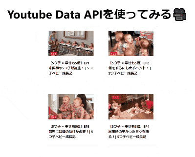

  
  
# このアプリについて

最近 Next.js を勉強し始め、一通り動画教材を視聴し終わったので  
「Next.js を使って何か作ってみよう！」という事で作った簡単なアプリです。

youtubeDataAPI を使用し、指定の再生リストに含まれる動画一覧を取得します。  
サムネイルをクリックすると、動画再生ページへ遷移します。

# 取得している情報

TLC Japan チャンネルで公開されている米国初の 5 つ子ちゃんの  
動画再生リストを取得しています 🥰
その他の再生リストを指定したい場合は、**apiUrl** 変数に格納している URL の  
**playlistId=【この部分】&key=** を変更してください。

# 使用する際の注意点

👉.env.local ファイルを作成し、URL と APIkey を格納する必要があります

1. ルートディレクトリに.env.local ファイルを作成
1. YOUTUBE_API に URL のパラメーターより前の部分を格納
   (https://www.googleapis.com/youtube/v3/)
1. YOUTUBE_API_KEY に発行した APIkey を格納

> **Warning**  
> **APIkey は絶対に外部に漏らさないように気を付けてください。**

👉 何かしらのエラーが出てデータを取得できなくても、処理は実行される  
 今回は練習ということで、fetch を使って簡単にデータを取得しています。  
 エラーが出た場合の処理は記述していません。  
 エラーが出たら特定の処理に移行したい場合は記述を変更してください。  
 axios を使用したデータ取得に変更しても良いかもしれません！

👉create-next-app を使用して、簡単に環境構築をしました。  
 スタイリングも create-next-app で自動的に生成されたものを使用しています。  
 自分好みのスタイリング方法を導入して使ってみてください！
